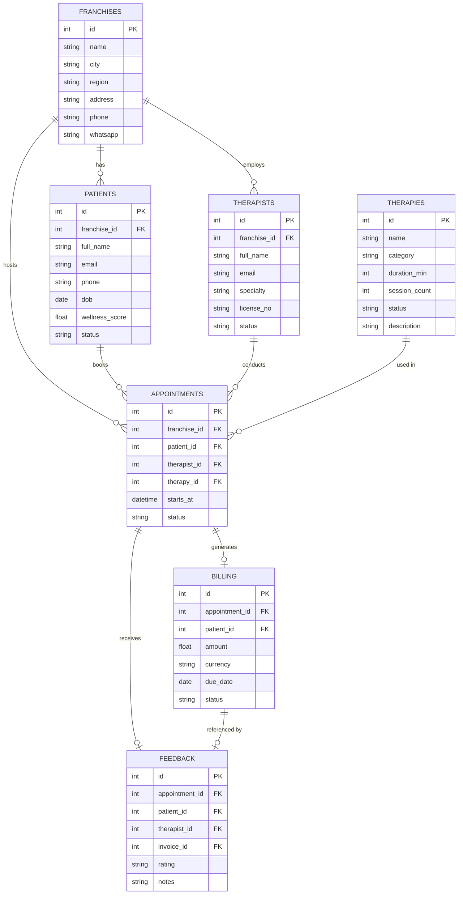

# DB.md

Source of truth: [kyochi_erd.html](/home/rael/build/movicloud/Main/kyochi/DesignArtifact/DesignIdeas/kyochi_erd.html)

## Final ER Diagram (Exact Model)

## Relationship List (Same as Final ER)

1. `FRANCHISES.id -> PATIENTS.franchise_id` (1 to many)
2. `FRANCHISES.id -> THERAPISTS.franchise_id` (1 to many)
3. `FRANCHISES.id -> APPOINTMENTS.franchise_id` (1 to many)
4. `PATIENTS.id -> APPOINTMENTS.patient_id` (1 to many)
5. `THERAPISTS.id -> APPOINTMENTS.therapist_id` (1 to many)
6. `THERAPIES.id -> APPOINTMENTS.therapy_id` (1 to many)
7. `APPOINTMENTS.id -> BILLING.appointment_id` (0 or 1 billing per appointment)
8. `APPOINTMENTS.id -> FEEDBACK.appointment_id` (0 or 1 feedback per appointment)
9. `BILLING.id -> FEEDBACK.invoice_id` (0 or 1 feedback per invoice)
10. `PATIENTS.id -> BILLING.patient_id` (many billings per patient)
11. `PATIENTS.id -> FEEDBACK.patient_id` (many feedback rows per patient)
12. `THERAPISTS.id -> FEEDBACK.therapist_id` (many feedback rows per therapist)

## Notes

- This document mirrors the final ER spec exactly from `DesignArtifact/DesignIdeas/kyochi_erd.html`.
- If runtime JSON seed files differ from this model, treat the ER above as target schema.
